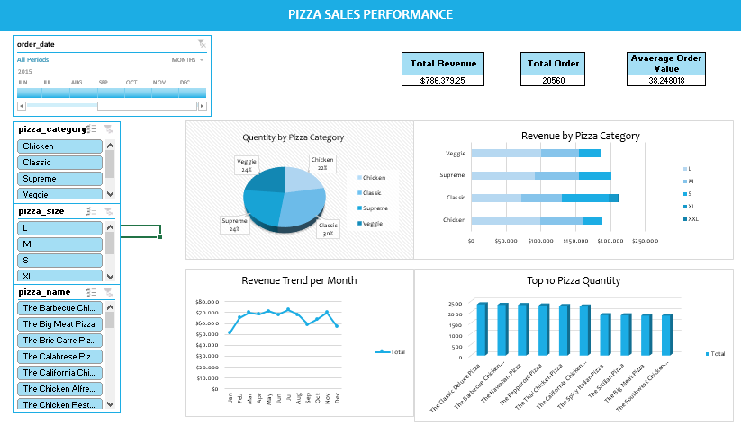

# 🍕 Pizza Sales Performance Dashboard Interactive

This repository contains a data visualization dashboard analyzing pizza sales performance over time using Excel. The dashboard provides insights into revenue, order trends, product category performance, and best-selling items.

🔗 **Dashboard Screenshot:**

---

## 📊 Key Business Questions & Insights

### 1. 💰 **What is the total revenue from pizza sales?**
- **$786,373.25**  
  → This indicates a strong overall revenue performance.

### 2. 📦 **How many total orders were received?**
- **20,560 orders**  
  → Reflects consistent customer demand throughout the year.

### 3. 💳 **What is the average revenue per order?**
- **$38.25**  
  → Suggests customers tend to buy multiple pizzas or large sizes per order.

---

## 🍕 Pizza Category Insights

### 4. **How many pizzas were sold by category?**
| Category | Quantity Sold |
|----------|----------------|
| Classic  | 3,031          |
| Supreme  | 2,681          |
| Veggie   | 2,441          |
| Chicken  | 2,261          |

→ **Classic pizza** dominates in popularity.

---

## 🏆 5. **Top 10 Best-Selling Pizzas by Quantity**

1. The Classic Deluxe
2. The Five Cheese Pizza
3. The Four Cheese Pizza
4. The Greek Pizza
5. The Green Garden
6. The Hawaiian Pizza
7. The Italian Capocollo
8. The Mexican Pizza
9. The Thai Chicken Pizza
10. The Pepperoni Pizza

→ These pizzas consistently contribute high sales volumes.

---

## 📈 6. **How does revenue trend over time?**
- Revenue remained stable throughout the year, with slight peaks around **mid-year (June–August)** and end of year (**holiday period, Nov–Dec**).

---

## 📐 7. **How does revenue vary by category and size?**

### Revenue by Pizza Category (per size):
- **Supreme & Classic pizzas in L and XL sizes** drive the most revenue.
- **XXL pizzas** contribute less overall due to lower frequency despite higher individual price.
- Veggie pizzas have consistent performance across sizes.

---

## 📁 Files Included

| File                     | Description                              |
|--------------------------|------------------------------------------|
| `Pizza_Sales_Dashboard.xlsx` | Excel file with interactive dashboard   |
| `README.md`              | Project summary and insights             |

---

## 🧠 Tools Used

- **Microsoft Excel**
- **Pivot Tables**
- **Slicers**
- **Charts & Graphs**
- **Conditional Formatting**

---

## 📌 About This Project

This project was built to practice dashboard design, slicer interactivity, and business insight storytelling using Excel. It is suitable for showcasing data analysis and dashboarding skills for entry-level data analyst roles.

---

## 🙋‍♂️ Author

**Anggara Prima Sektiaji**  
📧 [YourEmail@example.com]  
🔗 [LinkedIn Profile](https://linkedin.com/in/anggara-prima-sektiaji)  
🔗 [Tableau Public Portfolio](https://public.tableau.com/app/profile/anggara.prima.sektiaji)

---

## ⭐ Feel free to fork or star this project if you found it useful!
